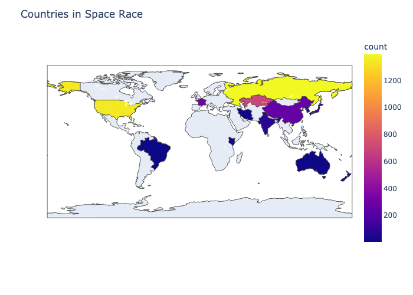

# Space Missions

Exploratory Data Analysis and Data Visualisation of Space Missions Since 1957, with a little bit of feature engineering and predictive modeling.

## Description

Who does not love Space?
The data includes all the space missions since the beginning of the Space Race (1957).

# Choropleth of the countries involved in the great space race.

 The plot may not be visible in the notebook itself due to limited rendering, so adding this in here.

 
