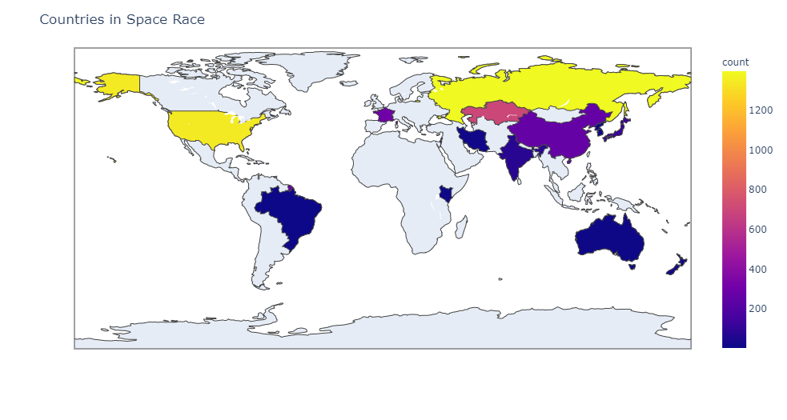

# Space Missions

Exploratory Data Analysis and Data Visualisation of Space Missions Since 1957, with a little bit of feature engineering and predictive modelling.

## Contents

- [Space Missions](#space-missions)
  - [Contents](#contents)
  - [Description](#description)
- [Chloropeth of the countries involved in the great space race.](#chloropeth-of-the-countries-involved-in-the-great-space-race)

## Description

Who does not love Space?
The DataSet includes all the space missions since the beginning of Space Race (1957).

# Chloropeth of the countries involved in the great space race.

 The plot may not be visible in the notebook itself due to limited rendering , so adding this in here.

 
